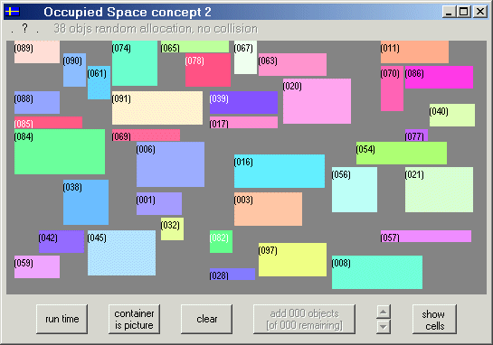



## OccupiedSpaceFun, this function allocates randomly many objects \(differerent size\), no collision\!

### Description

Populates container (form or picture) with objects, using the 'non-occupied space' concept.

Any added item, while populating the container, takes some cells from the 'unoccupied space':

it is a very fast process. Accurate demo and function design. Don't miss it!

----

OccupiedSpaceFun demo features:

- 2 switchable containers for the objects

- viewable 'non-occupied space' cells

- design/run time object sizes

On ideas proposed by Gunnar g68_se@yahoo.se, THIRD EMAIL (23rd August 2K1):

Thank you very much for your time and efforts Pietro !

It works very fine, except for one small thing:

My labels are all in different sizes, so it would

have to be some kind of combination of no-collision

and non-occupied space if i was to be able to

implement it :)

Best regards,

Gunnar.

----

This program has been written in Visual Basic 6.

I hope yow like the effort, have fun (ction...) :)
 
### More Info
 

             |
---                |---
**Submitted On**   |2001-08-31 08:49:12
**By**             |[pietro ing\. cecchi](https://github.com/Planet-Source-Code/PSCIndex/blob/master/ByAuthor/pietro-ing-cecchi.md)
**Level**          |Advanced
**User Rating**    |4.8 (19 globes from 4 users)
**Compatibility**  |VB 6\.0
**Category**       |[Math/ Dates](https://github.com/Planet-Source-Code/PSCIndex/blob/master/ByCategory/math-dates__1-37.md)
**World**          |[Visual Basic](https://github.com/Planet-Source-Code/PSCIndex/blob/master/ByWorld/visual-basic.md)
**Archive File**   |[OccupiedSp256458312001\.zip](https://github.com/Planet-Source-Code/pietro-ing-cecchi-occupiedspacefun-this-function-allocates-randomly-many-objects-differere__1-26823/archive/master.zip)

